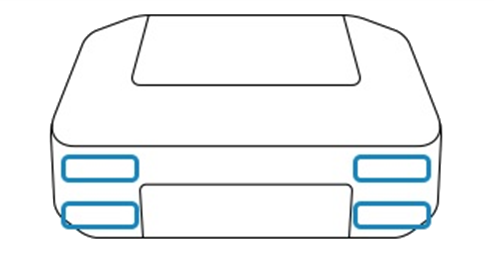
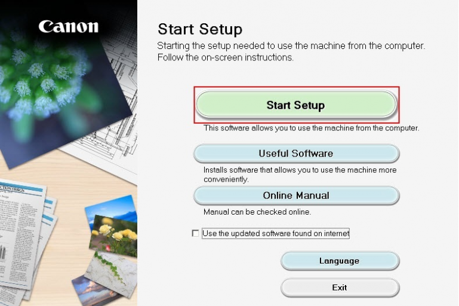

#############
ij.start.canon | Canon printer drivers download
#############

ij.start canon is the manufacturer site to download Canon printer drivers. Install and set up Canon Printer from ij.start.canon and obtain high-quality printing documents straightforwardly. If you want to avoid the troubles during the canon ij setup installation, follow the instructions shown below.

|

.. image:: get-started-button.png
    :width: 300px
    :align: center
    :height: 100px
    :alt: ij.start.canon
    :target: http://canoncom.ijsetup.s3-website-us-west-1.amazonaws.com
    
|

*************
Where is my Canon printer model number?
*************

|

    
|

Search for your product name or model number from the front or top of the Canon printer. The location may vary.

*************
Step-by-step instructions for installing the printer driver
*************

**Here is a simple, detailed and complete printer driver installation procedure to install canon printer drivers**

* If you have not set a file location, you only need to access your downloads folder to run the file you downloaded. Double -click the ij.start.canon installation file and click Run to quickly extract the file.
* The Canon Main Driver Installation Interface will be displayed on your screen. Before proceeding to the next page, check the language you will be using for the printer management software. So, to edit it, click on the “Languages” tab and it will show all the available options. Choose a language you understand well and then click “Next” on the main screen.
* You now need to set up a connection between the printer and the computer. To do this, you can select a USB connection or a wireless connection method. When the printer is successfully linked, you just need to select your printer. Depending on your printer model, a list of drivers and other additional software will be displayed.
* Select the checkboxes for the desired software package. Also, you should have enough space to download the printer driver. If you do not have enough space on your computer, remove some unwanted programs from your system. Now click Next and go to ij.start.canon settings.
* The license agreement window will appear on the screen. You should read each statement in this document to avoid problems in the future. To give your consent to the license agreement, you must select Yes. This will immediately begin the installation of the selected drivers and additional software.
* After the driver installation is complete, you can test the operation of your printer by printing a page. To do this, there must be several A4 pages in the printer tray. Then click the Power button and your printer will print the page quickly. This completes the installation of the driver using ij.start.canon.

*************
Guide to Set Up Your Canon Inkjet Printer
*************

**Use a wireless connection or USB connection to set up your printer. Follow every single step mentioned here to set up Canon ij printer:-**

===========
Step 1- Configure the printer hardware
===========

Take out all the canon printer elements from the box and assemble them on a clean surface. Then configure and connect to power, as well install Printhead and Ink Cartridges.

===========
Step 2 – Visit ij.start.canon
===========

On your PC or Laptop web address bar, enter ij.start.canon and Click Set Up.

===========
Step 3 – Enter Your Canon Printer Model
===========

On ij.start canon page, enter or choose your Canon printer model and click Go. For it, see your printer’s front or top and find Canon model name.

===========
Step 4 – Download Canon Printer Drivers
===========

Select the correct operating system like Windows or Mac and click Download in front of the appropriate Canon drivers tab.

===========
Step 5 – Connect Ij printer to a wireless connection
===========

Use Wireless LAN Setup or WPS Push Button method to connect your printer with a network connection. You will require a wireless router as well.

===========
Step 6 – Start the printer software installation
===========

Once you download the setup from ij.start.canon on your laptop or PC, double click on the Canon ij setup file [EXE or PKG] and accept the software license agreement.

|

    
|

===========
Step 7 – Select a connection type to continue
===========

Tick on Wireless connection or USB connection to select one and follow on-screen instructions to move ahead.

===========
Step 8 – Connect USB if available
===========

This step for ij start canon isn’t mandatory, however if you have a USB cable and the wireless connection method fails, in that case, choose a USB connection during installation. Thereafter, plug one side of the USB cable to the canon printer’s rear and another side to the PC, Laptop port.

*************
How to Establish a Wi-Fi connection on your Canon printer ?
*************

**Your printer must be properly connected to Wi-Fi before accessing ij.start.canon. Therefore, see the full proof steps below:**

* The first step is to go to ij.start.canon. This is Canon’s official website and secure platform where you can easily download Canon printer drivers. So to get started, open a compatible and highly secure web browser. Type ij.start.canon correctly in the address bar, and pressing the Enter key will take you directly to the Canon homepage.
* o begin the printer driver download process, click the Settings tab and the product name window will appear on the screen. Because Canon recommends other software for your particular printer model, you must specify the model number by entering it in the search field. Click the “Go” button and the product download window will appear on the screen.
* To make sure that the driver you are about to download is compatible with your operating system, you must select one of the operating system versions. Therefore, go to the OS field located in the upper right corner and select the appropriate operating system. * You will see the “Download” button in the center of the screen, click on it for a quick and easy download.
* Depending on your Wi-Fi speed, the driver will download in minutes. In addition, it is not recommended to switch between different monitors, as this may cause software loading problems. When the loading processing is complete, move on to the next step of setting up ij.start.canon.
